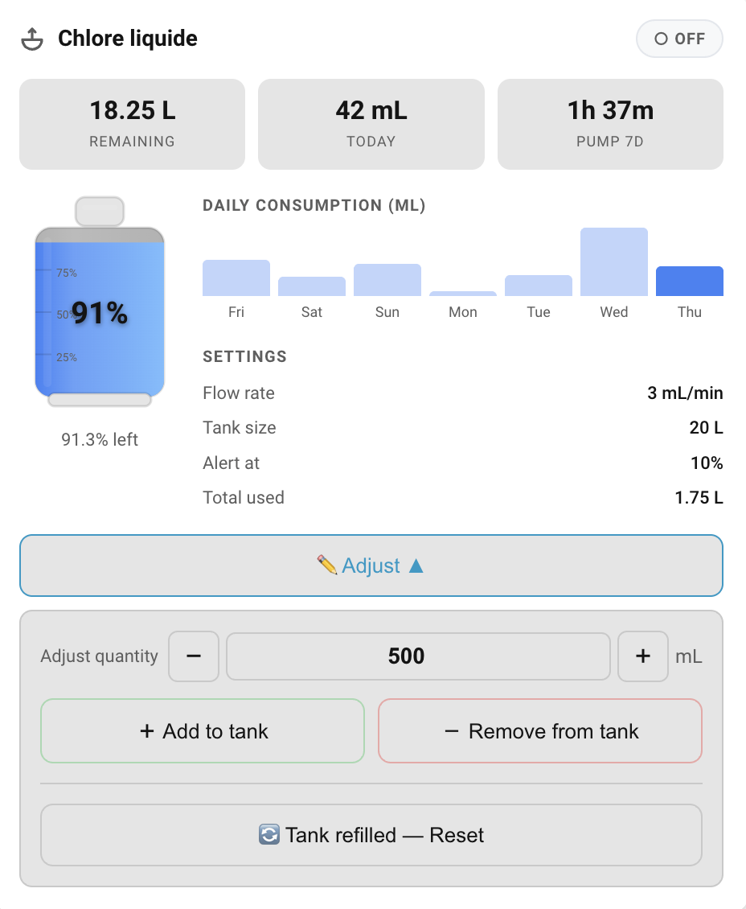

# Dosing Tank Card

[](https://github.com/ADNPolymerase/ha-dosing-tank-card)
[](https://github.com/ADNPolymerase/ha-dosing-tank-card/releases)
[](https://github.com/ADNPolymerase/ha-dosing-tank-card/actions/workflows/hacs.yml)
[](https://www.home-assistant.io/)
[](LICENSE)
[](https://buymeacoffee.com/adnpolymerase)

<a href="https://buymeacoffee.com/adnpolymerase" target="_blank"></a>

Home Assistant Lovelace custom card to visually track the level of a **liquid dosing tank** — chlorine, pH−, pH+, flocculant, algaecide, or any product injected by a pump at a constant flow rate.



---

## Features

- **Animated SVG tank** — liquid level transitions smoothly as consumption is calculated
- **Configurable liquid color** — blue for pH−, yellow for flocculant, green for algaecide…
- **Real-time pump badge** — ON / OFF reflects the current switch state
- **3 key metrics** — remaining volume (L), today's consumption (mL), 7-day pump runtime
- **7-day bar chart** — built from HA history, no extra sensors needed
- **Low-level alert** — configurable threshold; card turns red + shows a warning banner
- **Collapsible adjustment panel** — toggle to show Add/Remove/Reset controls, hidden by default
- **Multilingual** — auto-detected from your HA language setting: 🇬🇧 EN · 🇫🇷 FR · 🇪🇸 ES · 🇩🇪 DE · 🇮🇹 IT · 🇳🇱 NL
- **Dark mode ready** — uses HA CSS variables throughout
- **Responsive** — adapts to 1-, 2- or 3-column dashboard layouts
- **Zero dependencies** — vanilla JS, no framework, no npm

---

## Prerequisites

**A dosing pump switch entity** — any `switch.*` or `input_boolean.*` whose state is `on` while the pump injects product.

**An `input_number` helper** to persist the consumed volume across HA restarts.

Create it via **Settings → Devices & Services → Helpers → Create helper → Number**:

| Field | Value |
|---|---|
| Name | _(your choice, e.g. "Chlorine consumed")_ |
| Entity ID | _(your choice, e.g. `dosing_tank_consumed`)_ |
| Minimum | `0` |
| Maximum | `9999999` |
| Step | `1` |
| Unit | `mL` |

Or add to `configuration.yaml`:

```yaml
input_number:
  dosing_tank_consumed:
    name: "Dosing tank — consumed volume"
    min: 0
    max: 9999999
    step: 1
    unit_of_measurement: mL
    icon: mdi:cup-water
    mode: box
```

---

## Installation

### Via HACS (recommended)

1. In HACS → **Frontend** → **⋮** → **Custom repositories**
2. Add `https://github.com/ADNPolymerase/ha-dosing-tank-card` — category **Lovelace**
3. Click **Download**
4. Hard-reload the browser (`Shift`+`F5`)

### Manual

1. Download `dosing-tank-card.js` from the [latest release](../../releases/latest)
2. Copy to `config/www/dosing-tank-card.js`
3. **Settings → Dashboards → ⋮ → Resources → Add resource**
   - URL: `/local/dosing-tank-card.js`
   - Type: JavaScript module
4. Hard-reload the browser

---

## Configuration

```yaml
type: custom:dosing-tank-card
pump_entity: switch.pool_chlorine_pump
flow_rate_ml_per_min: 15
tank_volume_liters: 5
alert_threshold_percent: 20
reset_entity: input_number.dosing_tank_consumed
name: "Chlorine"
liquid_color: "#3b82f6"
# language: "fr"  # optional — auto-detected from HA locale by default
```

### Options

| Option | Type | Required | Default | Description |
|---|---|---|---|---|
| `pump_entity` | `string` | ✅ | — | Switch entity controlling the dosing pump |
| `reset_entity` | `string` | ✅ | — | `input_number` entity that stores consumed mL |
| `flow_rate_ml_per_min` | `number` | | `15` | Pump flow rate in mL/min |
| `tank_volume_liters` | `number` | | `5` | Tank capacity in litres |
| `alert_threshold_percent` | `number` | | `20` | Alert threshold (%) |
| `name` | `string` | | `"Dosing Tank"` | Title shown in the card header |
| `liquid_color` | `string` | | `"#3b82f6"` | Liquid color (any CSS hex color) |
| `language` | `string` | | auto | Language override: `en`, `fr`, `es`, `de`, `it`, `nl` (default: auto-detected from HA locale) |

### Color suggestions

| Product | Color | Hex |
|---|---|---|
| Chlorine (liquid) | Blue | `#3b82f6` |
| pH− | Orange | `#f97316` |
| pH+ | Purple | `#8b5cf6` |
| Flocculant | Yellow | `#eab308` |
| Algaecide | Green | `#22c55e` |


---

## How it works

### Volume tracking

Each time the pump switches **OFF**, the card calculates the session duration and calls `input_number.set_value` to increment the consumed-mL counter:

```
remaining = tank_volume_liters × 1000 − input_number.state − live_session_mL
```

> **Note:** The counter is only incremented while a browser tab with this card is open. For accurate tracking in the background, use the automation below.

### 7-day bar chart

Queries the HA history REST API — no extra sensors needed. Refreshed every 15 minutes.

### Reset

Click the reset button when you refill the tank. This sets the `input_number` to `0`.

---

## Automation for background accuracy

```yaml
alias: "Dosing tank — track chlorine consumption"
trigger:
  - platform: state
    entity_id: switch.pool_chlorine_pump
    from: "on"
    to: "off"
action:
  - variables:
      duration_min: >
        {{ (as_timestamp(now()) - as_timestamp(trigger.from_state.last_changed)) / 60 }}
      flow_ml_per_min: 15
  - service: input_number.set_value
    target:
      entity_id: input_number.dosing_tank_consumed
    data:
      value: >
        {{ [9999999,
            (states('input_number.dosing_tank_consumed') | float)
            + (duration_min * flow_ml_per_min) | round(0)
           ] | min }}
mode: queued
max: 5
```

Duplicate and adjust for each additional tank.

---

## Compatible entity types

| Entity type | Notes |
|---|---|
| `switch.*` | Full support |
| `input_boolean.*` | Full support |
| `binary_sensor.*` | Chart and display work; use the automation for counter updates |

---

## License

MIT — see [LICENSE](LICENSE)
